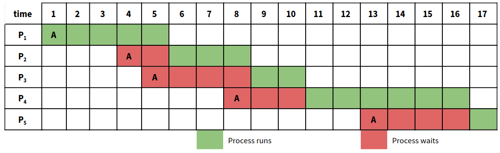
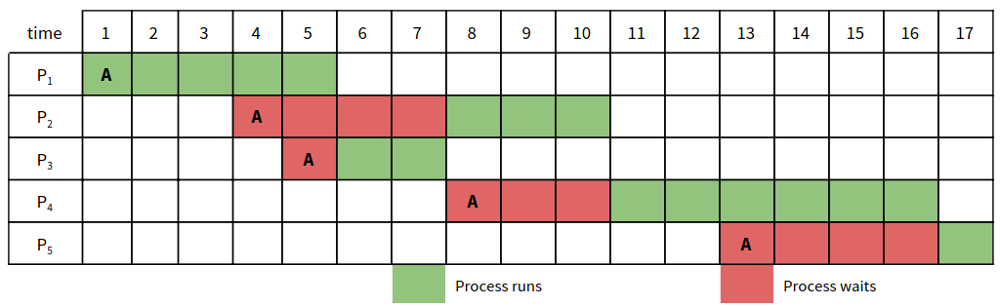
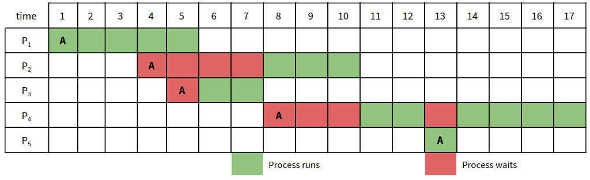
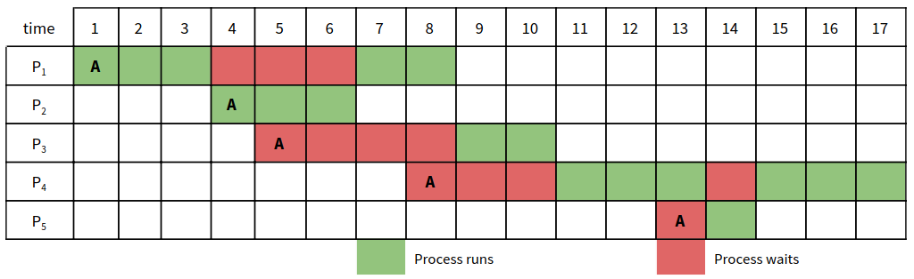

---
title: "Process Scheduling"
author: [JAC Hermocilla]
date: "\\today"
subject: "Markdown"
keywords: [Markdown, Example]
header-left: "CMSC 125 | Operating Systems"
header-center: "Process Scheduling"
header-right: "ICS-UPLB"
footer-left: "Revision: \\today "
footer-center: "\\thepage"
footer-right: "\\theauthor"
titlepage: true
...

# Process Scheduling

## Learning Outcomes

At the end of this session, the students should be able to:

1. describe the different process scheduling algorithms; and
2. implement a simulation of a process scheduling algorithm.

## Prerequisites 

1. Ubuntu 20.04 or higher with build tools
2. File I/O in C

## Process Scheduling (aka CPU Scheduling)

A process usually spends its run time in either executing instructions (CPU burst) or waiting for I/O completion (I/O burst). Assuming we have a single CPU, when waiting for I/O, the CPU is idle, doing nothing. In multiprogramming and time-sharing systems, several processes are allowed to run to maximize CPU utilization. When a process is waiting for I/O completion, another process is allowed to execute, keeping the CPU busy. Since CPU is one of the primary computer resources, scheduling of this kind is an important function to the operating system.

Selecting the process to execute is the task of the process scheduler module of an operating system. The process scheduler has access to the set of processes that are in the READY state. This set is often referred to as the ready queue. Processes in the ready queue are often referred to as blocked processes. Given the important role of the process scheduler, it is frequently invoked, and thus, hooked to the timer interrupt. The dispatcher is another process scheduling component which gives control of the CPU to the process selected by the scheduler.

## Preemptive and Nonpreemptive Scheduling

Process scheduling decisions take place when a process (1) switches from running to waiting state, (2) switches from running to ready state, (3) switches from waiting to ready state, or (4) terminates. These instances can be preemptive or nonpreemptive. In nonpreemptive systems, once the process scheduler has selected a process to execute, the process is allowed to run until completion. This happens when a new process must be selected, for instance, the first and fourth situations stated above. In preemptive systems, a process may be removed from the CPU when a new process arrives, even if it is not yet done with its task. This happens when certain conditions for preemption are met, for instance, the second and third situations described above. Modern operating systems are preemptive.

## Scheduling Criteria

There are several algorithms for process scheduling. To determine which scheduling algorithm is best for a particular situation, certain criteria must be considered:

* *CPU Utilization*. The percentage of time a process spends in the CPU relative to all the other processes.
* *Throughput*. The total number of processes completed per unit time.
* *Turnaround Time*. The total amount of time used up by a process (starting from its arrival in the ready queue up to its completion. 
* *Waiting Time*. The total amount of time a process spent waiting in the ready queue 
* *Response Time*. The amount of time it took for the process to wait in the ready queue until its first allocation in the CPU (from its arrival in the ready queue until its first execution).

## Scheduling Algorithms

Though most CPU architectures today support multiple processing cores, only a single processing core with one CPU burst in milliseconds per process will be considered in the examples. The measure of comparison that we will use is the average waiting time (AWT).

Consider the following processes for the scheduling algorithm examples:

| Process # | Arrival Time | Execution Time |
| :--------:| :-----------:| :------------: |
|    1      |    1         |       5        |
|    2      |    4         |       3        |
|    3      |    5         |       2        |
|    4      |    8         |       6        |
|    5      |    13        |       1        |

### First-Come, First-Serve (FCFS)

The processes will run in the CPU in the order they arrived at the ready queue. 
Once a process is running on the CPU, it cannot be interrupted until it completes 
its burst time.

### Shortest Job First (SJF) 

The process with the shortest execution time gets selected for execution (non-preemptive). It is assumed that the execution time is known upon the arrival of the process in the ready queue.

### Shortest Remaining Processing Time (SRPT)

Preemptive SJF. Preemption occurs whenever the new process has an execution time shorter than the remaining
time of the process being executed by the CPU.

### Round-Robin

Preemptive FCFS. Each job is allowed to occupy the CPU for a maximum period equal to time quantum, Q.
Preemption occurs whenever the process is unable to finish within Q. In the event that Q has expired, the next process in the ready queue is executed. For the example below, let’s define Q=3.

## Assesment Tool

A programming exercise for implementing the scheduling algorithms discussed.

## Acknowledgements

This material builds on top of the contributions by previous CMSC 125 instructors: Joman Encinas, Chris Templado, Betel de Robles, Zenith Arnejo, and Berna Pelaez 

## Further Reading

## References

Galvin, Peter B., Greg Gagne, and Abraham Silberschatz. “CPU Scheduling”. Operating system concepts. 10th ed., John Wiley & Sons, 2018, pp. 190-211

## License

This document is licensed under [CC BY-SA 4.0](https://creativecommons.org/licenses/by-sa/4.0/)
